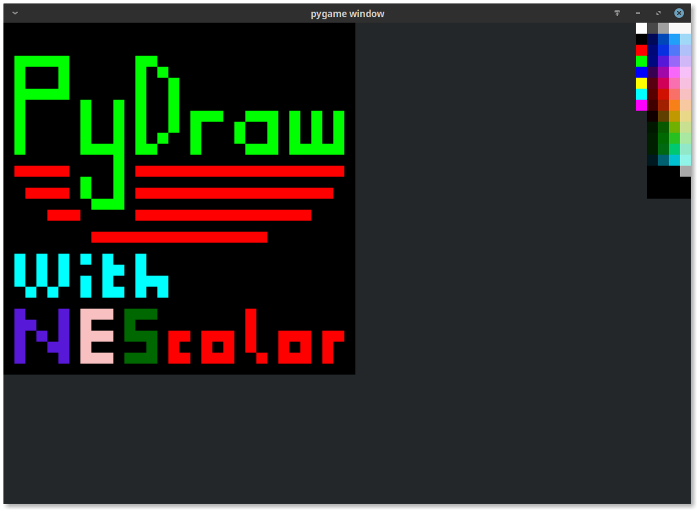

# PyDraw
This is a drawing program for making sprites, it is still in development and won't be ready for a while.
 
This needs python3.x and PyGames only. 
Under Mozilla Public License Version 2.0 
ToDo List:
- [x] Colour picker
- [x] Zoom
- [x] Options menu
- [x] Size settings
- [x] Shortcut to menu
- [ ] Save
- [ ] zoom settings
- [ ] Open
- [ ] Export
- [ ] Multiple shortcuts
- [ ] Shortcut editor

